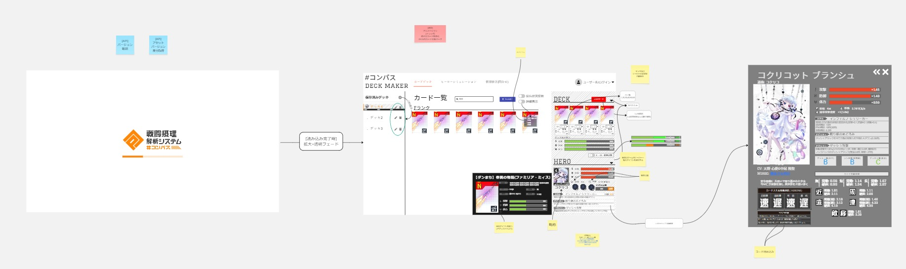

# WebUI 設計情報

閲覧用URL: https://miro.com/app/board/uXjVItjxBss=/?share_link_id=313226689720

## WebUIの設計
WebUIの設計は、Miroを使用して行っています。 
現在の画像は、実際の実装とは変更が発生している可能性があります。 
差異がある場合、開発チームにお問い合わせください。 

## UIの基本方針
- **シンプルで直感的なデザイン**: ユーザーが迷わずに操作できるよう、シンプルで分かりやすいUIを目指します。
- **レスポンシブデザイン**: デスクトップとモバイルの両方で快適に使用できるよう、レスポンシブデザインを採用します。
- **原作の雰囲気を尊重**: ゲームの雰囲気を損なわないよう、原作のデザイン要素を取り入れます。

## Miroの編集
Miroの編集は、開発チームのメンバーが行います。 
編集権限が必要な場合は、開発チームにお問い合わせください。 